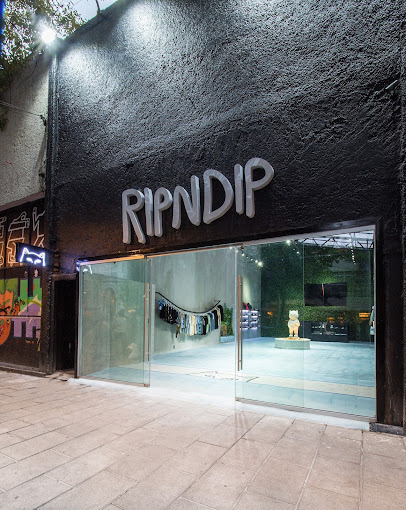

# rage

### Challenge Overview

The challenge presents a scenario where a protest against soaring housing prices (gentrification) occurred in Mexico City in **July 2025**. We are given a link to a Jiji Press article (referenced as `2025070500264`) featuring a photo of a vandalized store. The goal is to identify the store and find its **opening date** (local time) in `YYYY/MM/DD` format.

<figure><figcaption></figcaption></figure>

***

### Initial Assumptions

1. **News Source Validation:** The Jiji Press link provides the anchor for the event date (July 4-5, 2025). The photo in the article is the primary clue.
2. **Visual Identification:** The vandalized store in the photo must be identifiable by its logo, mascot, or architecture, even if covered in graffiti.
3. **Location Context:** The protest occurred in neighborhoods heavily affected by gentrification, specifically **Roma** and **Condesa**.

***

### Investigation Process

#### Step 1: Identifying the Store from the Photo

* **Visual Clue:** The store features a white cat mascot (**Lord Nermal**), iconic to the streetwear brand **RipNDip**.

<figure><figcaption></figcaption></figure>

* **Location Match:** Article mentions protests centered in **Roma Norte**. Searching "RipNDip store Mexico City" confirms the flagship location is in this neighborhood.

<figure><figcaption></figcaption></figure>

* **Address:** Orizaba 34, Roma Nte., Cuauhtémoc, 06700 Ciudad de México.

<figure><figcaption></figcaption></figure>

#### Step 2: Determining the Opening Date

* **Objective:** Identify the opening date of the Roma Norte store (Orizaba 34), not previous Polanco/Granada location.
* **Search Queries:** `RipNDip Mexico City Roma Norte opening date`, `RipNDip Orizaba 34 inauguration`.

<figure><figcaption></figcaption></figure>

* **Source (Social Media):** RipNDip Facebook (`RIPNDIP`) posted the Grand Opening announcement.
* **Contextual Verification:** A vlog titled "Grand opening of the new Ripndip CDMX Store tomorrow 11am-8pm" confirmed the Roma Norte location and opening date.

<figure><figcaption></figcaption></figure>

***

### Key Findings

* **Store Name:** RipNDip Mexico City
* **Location:** Orizaba 34, Roma Norte
* **Opening Event Date:** Saturday, September 14, 2024

***

### Final Flag / Answer

```
SWIMMER{2024/09/14}
```

***

### Notes & Takeaways

* **Relocation Awareness:** The RipNDip Mexico City store moved from a previous address (Lago Tanganica). It's crucial to focus on the opening date of the **current** location (Roma Norte).
* **Gentrification Context:** Understanding the protest's theme helps narrow down affected neighborhoods (Roma and Condesa), where international brands like RipNDip are symbolic targets.

***

#### References / Sources

* [RipNDip Mexico City Official Page](https://ripndip.mx/pages/ripndip-cdmx)
* [Mexico News Daily Article on Protests](https://mexiconewsdaily.com/mexico-living/the-awkward-truth-behind-mexico-city-protests-anti-gentrification/)
* [Facebook Vlog / Event Video](https://www.facebook.com/watch/?v=372025589292392)
