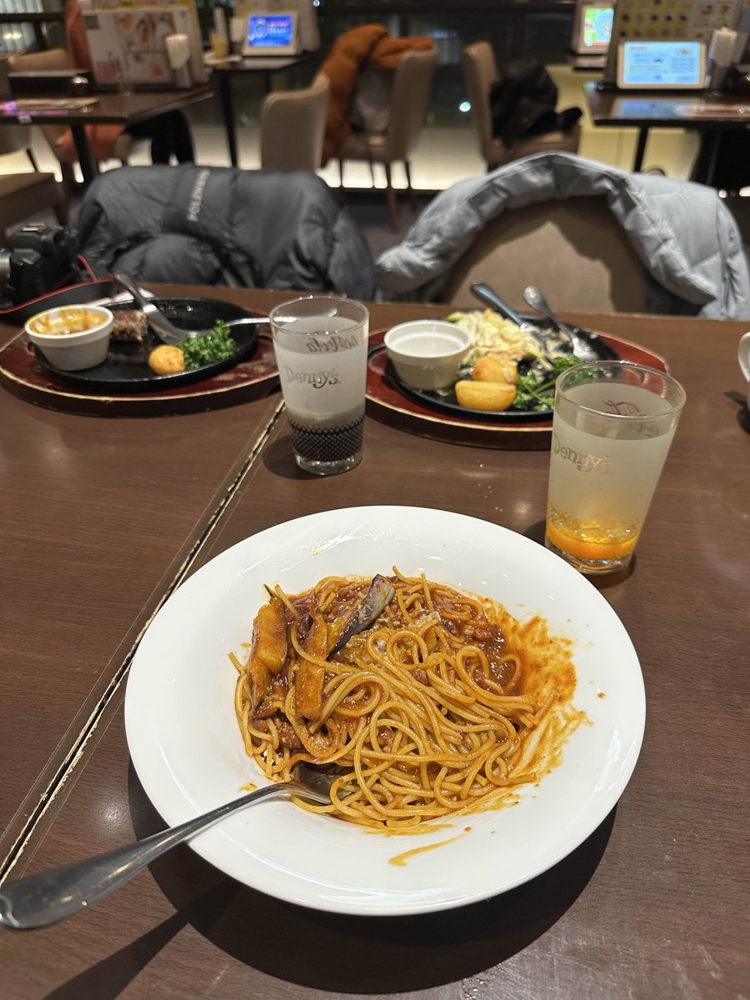

# lilica\_07\_work

### Challenge Overview

The goal of this challenge was to identify the **nearest Tokyo Metro station** to the workplace of the target, "Lilica". We were provided with:

* Her X (Twitter) handle: **@twilight\_lilica**
* Her real name: **Shiharu Nanaogi**
* A photo from her account
* Metadata from an **.fbx** file

***

### Initial Assumptions

* OSINT is key: Correlate her online identity with physical locations.
* Object Identification: Visual clues in the photo may indicate her employer.
* Strict Station Naming: Only a Tokyo Metro station should be selected; JR and private lines (like Tokyu) must be excluded.

***

### Investigation Process

#### Step 1: Analyzing the Image (The Physical Clue)

* Observed the image posted at a restaurant (identified as Denny's based on aesthetics).
* Noticed a jacket draped over a chair.
* The label on the collar read **"POLEWARDS"**.

<figure><figcaption></figcaption></figure>

* Research revealed POLEWARDS is a brand owned and manufactured by **Zanter Co., Ltd. (ザンター)**. [Reference](https://polewards.com/pages/about-polewards)

<figure><figcaption></figcaption></figure>

#### Step 2: Analyzing Digital Footprints (The Profession)

* File path from her computer:

```
\Users\shiharu_nanaogi\Documents\modeling\vrc_test\hair_pin\simple_hair_pin.fbx
```

* Inference: She is a **3D Designer**, creating VRChat assets.
* Website confirmation: **twilight-lilica.com** shows she is a Freelance Designer focusing on 3DCG.

<figure><figcaption></figcaption></figure>

* Connecting the dots: A 3D Designer with a POLEWARDS jacket likely works at **Zanter Co., Ltd.** (possibly in digital fashion/marketing).

#### Step 3: Geolocation of the Workplace

* Company: Zanter Co., Ltd.
* Address: **Japan, 〒153-0042 Tokyo, Meguro City, Aobadai, 4 Chome−7−1 4F**

<figure><figcaption></figcaption></figure>

#### Step 4: Determining the Station

* Candidate A: **Ikejiri-Ohashi Station** (\~600m) — closest physically but **Tokyu Den-en-toshi Line** (rejected).

<figure><figcaption></figcaption></figure>

* Candidate B: **Shibuya Station** (\~1.1km) — major hub, walking distance longer.

<figure><figcaption></figcaption></figure>

* Candidate C: **Naka-meguro Station** (\~1.1km) — terminus of **Tokyo Metro Hibiya Line**, located in the same ward (Meguro-ku).

<figure><figcaption></figcaption></figure>

***

### Key Findings

* Target Brand: **POLEWARDS** (owned by Zanter)
* Workplace: **Zanter Co., Ltd. Headquarters**
* Location: **Aobadai, Meguro-ku**
* Nearest Metro Station: **Naka-meguro Station (Hibiya Line)**

***

### Final Flag / Answer

```
SWIMMER{中目黒}
```

***

### Notes & Takeaways

* **Brand Reconnaissance**: Clothing items and brands often provide direct links to the target's employer.
* **File Metadata**: File paths, like `vrc_test`, reveal the type of designer she is.
* **Train Line Specificity**: In Japan-based CTFs, distinguish between JR, Private Railways (Tokyu, Odakyu), and Tokyo Metro. The nearest station must meet the line requirement, not just physical proximity.
